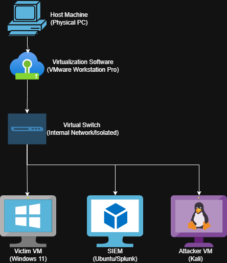

# 🛡️ Virtual SOC Lab: Splunk & Sysmon

## 📌 Project Overview
The goal of this project is to build a functional Security Operations Center (SOC) environment to simulate real-world cyber attacks and analyze them using Splunk.

### 🏗️ Current Progress: Phase 1 (Infrastructure)
- [x] Deployed Ubuntu Server 22.04 LTS.
- [x] Installed Splunk Enterprise.
- [x] **Hardening:** Migrated Splunk service to a non-root user account (`splunk`).
- [x] Configured `systemd` for service persistence.
- [x] Install Windows 10/11 Victim.
- [x] Milestone: Bi-Directional Connectivity Established
      Validation: Successfully performed ICMP echo requests between (SIEM) and (Endpoint).
      Firewall Configuration: Applied granular inbound rules to the Windows 11 victim to allow ICMP traffic for connectivity testing while maintaining a hardened            posture for other non-essential ports.
- [ ] Deploy Sysmon & Universal Forwarder.

### 🌐 Network Topology

"Configured static IP assignments for endpoint telemetry; currently utilizing a flat network topology with DNS resolution deferred to the local host for simplified log routing during Phase 1."
